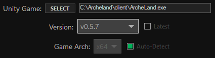
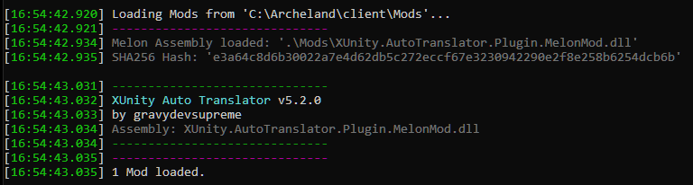

## Archeland Installation (English Patch)

:imagesdir: ../images

_Based on the link:https://www.prydwen.gg/archeland/guides/english-patch[Prydwen guide], and the guide for alternative translation patching from the link:https://discord.com/channels/993365569162203186/1049902527774203986/1095457975063302335[Archeland discord]._

Join the Archeland discord link:https://discord.gg/archeland-zlongame-993365569162203186[here], manually fixed translations can be found in the link:https://discord.com/channels/993365569162203186/1049902527774203986[#translations] channel.

The below steps should be done *_in order_*, as they rely on the previous steps.

. Download the Archeland launcher from link:https://kru2update.zlongame.co.kr/KRU2/Clientdown/Archeland_Setup.exe[here]. This will download the actual game. Note that the GB shown is *NOT* the size of the game, but the size available in the currently selected hard drive, the actual game is around 10-12 GB in size.
.. Remember where you installed the game, it will be used in the next step.
. Once the game is done downloading, download the latest version of link:https://github.com/LavaGang/MelonLoader[MelonLoader] from link:https://github.com/LavaGang/MelonLoader/releases/download/v0.6.1/MelonLoader.Installer.exe[here].
.. Run the `MelonLoader` exe and select the `{InstallDirectory}/client/ArcheLand.exe` as the target Unity game.
.. Deselect `Latest` and select `v0.5.7`, leave `Game Arch` as is. It _should_ default to `x64`.
.. It should now look something like this: +
 +
 _(Where `C:\Archeland\client\Archeland.exe` should instead be *your* `{InstallDirectory}/client/ArcheLand.exe` path)_
.. Click the `INSTALL` button.
. Download link:https://github.com/bbepis/XUnity.AutoTranslator/[XUnity.AutoTranslator] plugin for Melon Loader from link:https://github.com/bbepis/XUnity.AutoTranslator/releases/download/v5.2.0/XUnity.AutoTranslator-MelonMod-5.2.0.zip[here].
.. Extract the contents of the `XUnity.AutoTranslator-MelonMod.zip` _(the file you downloaded in the previous step)_ to your `{InstallDirectory}/client` directory, overwriting files if needed.
. Download an already setup `AutoTranslator` directory from link:https://cdn.discordapp.com/attachments/145963699343982593/1102245088685469727/AutoTranslator.zip[here].
.. Extract the contents of `AutoTranslator.zip` to your `{GameInstall}/client/` directory, overwriting files if needed.
. If everything is installed correctly, when launching Archeland _two_ windows should be opened up, the game window, and a console window.
.. Check in the console window that the `XUnity.AutoTranslator` mod was properly installed, it should look something like this: +
.
.. If either of the above steps is false, reread the previous steps and check if you've missed something.
.. Note that the auto translator is not instant and will take a bit to translate the Korean text, and some lines may not get translated, but the vast majority should get translated.
.. If you wish to hide the MelonLoader console window, you can launch the application with the `--melonloader.hideconsole` parameter.